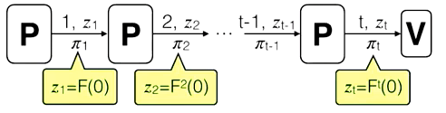

# zk-SNARK: computational model, IP, compilers, zk proof, SNARK
# zk-SNARK

Zero-Knowledge Succinct Non-interactive Arguments of Knowledge (zk-SNARKs) is a non-interactive proof system.

## The process to generate zk-SNARK for a problem

Translate/Reduce the problem/statement/witness/proof/argument to some representation (computational model or polynomial) so that it can be input into the proof system.

1. Problem/statement/witness → 
2. [Optional ]Program (some work can directly compile proof from the programming language, e.g., [SNARKs for C](https://eprint.iacr.org/2013/507.pdf)) → 
3. Computational model, aka computation representation (different representations/characterization: boolean circuit -BC, arithmetic circuit - AC, Rank-1 constraint system - R1CS, quadratic arithmetic program - QAP, Quadratic Span Programs - QSP) →
4. A sequence of polynomial

Proof system:

1. Information-Theoretic Interactive proof system, e.g. IP, PCP, IOP
2. Compile the info-theoretic proof system into a practical one using cryptographic primitives (compiler is the tool or transformer)
    1. Interactive → Non-interactive: Common reference string - CRS, Fiet-Shamir
    2. Theoretic → practical: Polynomial commitments scheme - PCS, LES
3. [Add-on] zero knowledge

Some terms:

- proof vs argument: argument has less soundness than proof but is still safe in a computational way
- The "of Knowledge" suffix is used (for both Proofs or Arguments) when the prover holds information that can be extracted *efficiently* via a "special setup" (special in an analogous way the Simulator is special). Proof (not of knowledge) can be to prove that a number is a prime. Proof of knowledge can be to prove Bob knows the answer to the math problem.
- knowledge extractor (used in the proof of knowledge): extract the witness through ~
- witness (for an NP statement): a piece of information that makes you efficiently verify that the statement is true. witness vs proof: the witness is mainly for NP problems while proof is usually shorter and faster than witness in a proof system (with a high probability).
- Succinct: the size of the proof is smaller than the witness
- commitment: A cryptographic commitment is a scheme that allows one to commit to a chosen value while keeping it hidden from others, with the ability to reveal the value at a later time.
- PPT: probabilistic polynomial-time
- random oracle: in cryptography, an oracle responds to every unique query with a random response chosen uniformly from its output space.
- oracle: in complexity theory and computability theory, an oracle is an abstract machine used to study decision problems. It can be visualized as a Turing machine with a black box. It can solve the problem in a single operation. The problem can be of any complexity class.
- one-way function: easy to compute the output but hard to find the input using the output

# Computational model

Computational model/Characterizations/representation: TBD cite

- Boolean circuit: composed of or, and, not, xor gates/operators
- Arithmetic circuit: composed of +, -, *, / gates
- R1CS (Rank-1 constraint system). 
The idea of R1CS is that it keeps track of the values that each variable assumes during the computation, and binds the relationships among all those variables that are implied by the computation itself.
rank-1 is referring to each of the quadratic equations in A*B+C = 0
- QAP/QSP (quadratic arithmetic program;  Quadratic Span Programs). QSP is to find a linear combination of those that is a multiple of given polynomials. It is transformed from boolean circuits while QAP is transformed from arithmetic circuits. A QSP over field F consists of a set of polynomials over F, a target polynomial t over F, and an injective function.
    
    QAP, like QSP, are a characterization of NP. They naturally capture arithmetic programs. Their advantage over QSP is that they lead to more efficient SNARGs for statements whose verification procedure is compactly represented by an arithmetic circuit. They have at least the same power, and you can represent the verification algorithm of arbitrary NP languages (hence also NP-complete languages) using them. Note that they are a computation model, not a language, so it does not mean anything to say that QAPs (or QSPs) are NP-complete - but they do capture all of NP.
    
    QAP is proposed in the same paper of QSP: [https://eprint.iacr.org/2012/215.pdf](https://eprint.iacr.org/2012/215.pdf)
    QSP: 2 sets of polynomial, QAP: 3 sets
    
- PCP (Probabilistically Checkable Proofs)

- CRS: In cryptography, the common reference string (CRS) model captures the assumption that a trusted setup in which all involved parties get access to the same string CRS taken from some distribution D exists. Schemes proven secure in the CRS model are secure given that the setup was performed correctly.
Proofs in the CRS model have a standard reduction-based proof of security. It needs a trusted setup.
- ROM: random oracle model. Proof in the ROM model is heuristically secure because the protocol instantiation uses a hash function that is not a random oracle.

# Proof system

## Interactive proof system

1. Definition: in computational complexity theory, an interactive proof system is a machine that models computation as the exchange of messages between a prover and verifier. The prover has unlimited resources and can be dishonest while the verifier has limited resources and is honest.
2. Property
    1. Completeness
    2. Soundness
3. Classes of interactive proofs
    1. NP problem (cannot be solved by the prover in polynomial time but can be verified in polynomial time by the verifier)
    2. Arthur-Merlin proof
    3. Public coin protocol vs private coin protocol
    The verifier publishes its random choices in the former protocol, i.e., the global parameters are chosen randomly, e.g., by hashing a famous quote. This is the most ideal setup, i.e., without trusted setup.
    A proving system has a private coin setup if it needs a trusted party or 
    4. IP
    In computational complexity theory, the class IP (interactive polynomial time) is the class of problems solvable by an interactive proof system. 
    It is equal to the class PSPACE. Decision problems that can be solved using a polynomial amount of space are called PSPACE. Shamir [Sha92] established IP=PSPACE in 1992 and Shen [Shen92] gave a simplified proof version later. Proof of IP=PSPACE can be divided into IP ⊆ PSPACE and PSPACE ⊆ IP. NP ⊆ PSPACE and coNP ⊆ PSPACE, so NP ⊆ IP.
    5. PCP
    Actually it is non-interactive proof system.
    PCP Theorem: NP = PCP(log n, 1) where r(n) and q(n) is the number of random coins and queries in PCP(r(n), q(n)).
    6. Relations
    NP ⊆ IP; IP = PSPACE; NP =PCP(log n, 1) 
4. Examples
    1. Sum-Check Protocol
5. Else
    1. Multilinear extension (MLE)

IP can be transformed to computationally ZK proofs or perfectly ZK arguments. - Ben-Or et al. [8] and Cramer and Damgård [37] from Hyrax.

# Compiler (cryptographic primitive)

Includes commitment schemes and others, e.g., hash function.

### Commitment Scheme

A commitment scheme is a cryptographic primitive that allows one to commit to one message m (value or statement) while keeping m hidden and publishing the commitment c to others with the ability to reveal m later.

1. Properties
    1. Binding: the prover cannot change the commitment anymore
    2. Hiding: cannot know the message from the commitment
    3. Additive homomorphy: e.g., Pederson commitment, RSA-based commitment
    4. Note: binding and hiding can be implemented on two different levels (computational and statistic/theoretic/perfect). Computational means that it’s safe in a PPT way. Theoretic one means that it’s safe against a prover with unbounded computation power. Theoretic binding and theoretic hiding cannot hold at the same time.
2. Usage: coin flipping, zero-knowledge, secure (multi-party) computation
3. Assumptions may be used
    1. RSA assumption
    2. Strong RSA assumption
    3. Discrete logarithm assumption
    4. q-Strong Diffie-Hellman assumption
4. Process
    1. A committer/sender decides (is given) a secret message m taken in some public message space with at least two elements;
    2. chooses a random value r;
    3. produce a commitment c=C(m, r) by applying some public method (the commitment algorithm C) defined by the scheme;
    4. publishes c;
    5. later reveal m and r;
    6. The verifier/receiver checks if C(m, r)=c;
5. Construction
    1. Bit-commitment in the random oracle model. 
    f(x) is uniformly distributed and there is no different x giving the same f(x)
    2. Bit-commitment from any one-way permutation. 
    It’s hard to get x from f(x).
    3. Bit-commitment from a pseudo-random generator
    Since we don’t know how to construct a one-way permutation from a one-way function, we reduce the cryptographic assumption.
    4. A perfectly binding scheme based on the discrete log problem and beyond
    E.g., Pedersen commitment
    5. A perfectly hiding commitment scheme based on RSA
6. Partial reveal
    1. Definition: reveal part of the committed message
    2. Examples
        1. Vector hashing. 
        **Commit**: for a set of messages {x1, x2, …, x_n}, choose random value {m1, m2, …, m_n}, generate their hashing first {y1=H(m1, x1), …} and then generate the hashing of y - C=H(y1||y2||…||y_n). 
        **Reveal**: in order to prove an element x_i in X, the prover release (i, y1, y2, …, x_i, m_i, y_i+1, …, y_n).
        Verify: the verifier computes y_i* = H(m_i, x_i) and then computes and checks C.
        2. Merkle tree. 
        Commit: for a set of messages, generate a binary hash tree where the leaf nodes are the messages and other nodes are the hashing. 
        Reveal: to prove x_i, the prover release the path to x_i in the tree. (2 elements in every level)
        Verify: v recomputes the released tree.
        3. KZG commitment

### Popular commitment schemes

1. Pedersen Commitment
    1. ~ uses a public group (G, ) of large prime order q in which the discrete algorithm is hard, and two random generators g and h. Random value r is chosen in Z_q, the message m is from any subset of that. The commitment is C(m, r) = g^m * h^r.
    1992, Paper: [Non-interactive and Information-Theoretic Secure Verifiable Secret Sharing](https://link.springer.com/content/pdf/10.1007/3-540-46766-1_9.pdf)
    2. Additional property: homomorphy
2. Fujisaki-Okamoto commitment
    1. Same as the Pedersen ~ except this one uses an RSA group.
3. FRI (BenSasson-Bentov-Horesh-Riabzev)
    - No trusted-setup, large proofs (>100KB), quantum secure
    - SNARK schemes using FRI: FRI-STARK
4. DARK (Bünz-Fisch-Szepieniec)
    - No trusted–setup, smaller (8KB), not quantum secure
    - SNARK schemes using DARK: Supersonic
5. Bilinear group commitment (Kate-Zaverucha-Golberg)
    - Trusted–setup, very small (32 Bytes), not quantum secure
    - SNARK schemes using Bilinear group: Sonic/PLONK/Marlin

from **[Transparent SNARKs from DARK Compilers](https://eprint.iacr.org/2019/1229.pdf)**

### Terms

1. cryptographic primitive: well-established cryptographic algorithm/function that can be used to build cryptographic protocols.
2. a group G is a finite or infinite set of elements that support binary operation (called the group operation) that together satisfy these properties: (see [Wolfram Mathworld](https://mathworld.wolfram.com/Group.html))
    1. closure: if A, B is in G, then A+B in the G
    2. associativity: (A B) C = A (B C)
    3. identity: an identity I (aka, 1, E, e) that makes A I = A
    4. inverse: for each element A in G, there is a B = A^-1 s.t. A A^-1 = I
3. generator: a group element n that makes the list g^0, g^1, …, g^{n-1} contains all the elements in the group.

# zk proof

1. ZKRP: zero-knowledge range proof, a proof that a secret value is in a certain range (from 0 to 2^n — 1 ). It is not as generic as ZKP.
2. NIZK: A Non-Interactive Zero Knowledge proof
    
    A ZK-SNARK is a NIZK (more precisely, a non-interactive zero-knowledge argument of knowledge in the common reference string model) which is succinct, meaning that both the proof size and the verification time grow sublinearly with the witness size.
    Therefore, every ZK-SNARK is in particular a NIZK (but not all NIZKs are ZK-SNARKs).
    

zk proof can be used to prove knowledge and [membership](https://www.notion.so/Proof-of-membership-e6ad413e5eee4255b3e6e4d05e283f67?pvs=21).

# SNARKs

1. verifiable delay function: a cryptographic function that needs to be computed in sequential steps and its output can be easily verified.
2. bootstrap:

recursive SNARKs:

It can speed up the proof by splitting a large circuit into several small ones and proving them. The t proof proves the correctness of t-1 proof and the current proof.

1. SNARG: a proof for computation correctness whose size is exponentially smaller than the proved computation. 
    - Prover: circuit C, witness w, and input x. The prover would say that I know a w s.t. the circuit C(w,x)=1. The size is poly(k, log |C|).
    - Verifier: circuit C and input x.
2. Motivation
    1. Example: proving iterative execution of the function F: z^t=F^t(0). 
    2. Monolithic option: prove it after all the iterative execution of F. Cons: infeasible - memory grows with t; unknown t
    3. Recursive option: prove the correctness of one execution & the prior proof
        
        

        
3. IVC and PCD
    1. incrementally verifiable computation (IVC)
    An IVC scheme for a predicate \Omega is the tuple of (P, V) that satisfies 3 properties (functionality, security, and efficiency) - see this [Google doc](https://docs.google.com/document/d/1meiUdHYvixfiIgr1pexRqHjDIijRPW0I/edit) for more. The predicate \Omega is like a function \Omega(z_t, w_t, z_{t-1})=1 \iff \exists w_t s.t. z_t=F(z_{t-1}, w_t). The current proof exists.
        1. functionality: \Omega(z_t, w_t, z_{t-1})=1 and V(z_{t-1}, \pi_{t-1}) =1 , i.e., the prior proof is correct. Then generate $\pi_t$ 
    2. proof carry data (PCD)
    A tuple of (P, V) that is similar to IVC but allows multiple prior outputs to be fed into the input of the next recursion.
    3. Way-1 Obtain a recursive SNARK by converting a SNARG to an IVC form and then check its condition of being SNARK. 
        1. (see doc) 
        2. The theorem in [BCMS20] states if the SNARG is an argument of knowledge then the IVC is secure, and if the SNARG has a succinct verification (time(V) < |C|) then the IVC scheme is efficient. It’s also true for PDC. The point on security is fulfilled by most SNARKs, but the point on efficiency varies depending on the scheme. As seen from the various SNARK schemes, some have chosen to improve certain characteristics while accepting longer verification times.
    4. Way-2 [BCMS20] SNARG with accumulator
        1. It comes from the idea that for recursion it should be sufficient to incrementally update a state that has the memory of the conjunction of valid past proofs and verify this conjunction outside the recursive circuit [BGH19]
4. References
    1. An overview of recursive SNARKs pred by Alessandro Chiesa (UC Berkeley, StarkWare, Zcash) on 2022 
    2. [SNARKs Lecture 5: Transparency, Recursive Proving](https://securitylab.github.io/cs251-fall19/lectures/SNARKLecture5.pdf) by Ben Fisch

# References

## zk-SNARK

1. [Explain the Pinocchio protocol (PGHR13) from the program to the proof system](https://www.zeroknowledgeblog.com/index.php/the-pinocchio-protocol) posted by Maurizio Binello (zero-knowledge blog) on June 2019
2. [Zk-SNARKs: Under the Hood](https://medium.com/@VitalikButerin/zk-snarks-under-the-hood-b33151a013f6) by Vitalik Buterin on Feb 3, 2017
3. [zkSNARKs in a nutshell](https://blog.ethereum.org/2016/12/05/zksnarks-in-a-nutshell) Posted by Christian Reitwiessner on December 5, 2016
4. (Not read) [vnTinyRAM Continuing the zkSNARK tutorials](https://blog.plan99.net/vntinyram-7b9d5b299097) Posted by Mike Hearn on Dec 15, 2016. Related paper: [SNARKs for C](https://eprint.iacr.org/2013/507.pdf)
5. (Not read) [The missing explanation of zk-SNARKs: Part 2](https://www.cryptologie.net/article/508/the-missing-explanation-of-zk-snarks-part-2/) Posted on Nov 2020
6. (Not read) Why and How zk-SNARK Works: Definitive Explanation ([paper](https://arxiv.org/pdf/1906.07221.pdf))
7. (Not read) [Commitment Schemes Basic concepts and ideas](https://medium.com/iovlabs-innovation-stories/commitment-schemes-4f3590be8c5) Posted by Ramses on Dec 1, 2021
8. (Not read) Commitment Schemes and Zero-Knowledge Protocols (2011) [paper](https://homepages.cwi.nl/~schaffne/courses/crypto/2014/papers/ComZK08.pdf)

## Computational model

1. Gennaro, Rosario, et al. "[Quadratic span programs and succinct NIZKs without PCPs.](https://www.andrew.cmu.edu/user/bparno/papers/quadratic.pdf)" *Annual International Conference on the Theory and Applications of Cryptographic Techniques*. Springer, Berlin, Heidelberg, 2013. (QSP, QAP)
2. Cryptographic primitives in blockchains by Licheng Wang

## Proof system

1. [Important and classic research of IC, IP, IOP](https://complexityzoo.net/Complexity_Zoo:I)

## Compilers

## zk proof

1. Proofs, Arguments, and Zero-Knowledge by Justin Thaler (keep updating)

## Else

1. Lecture [https://cs251.stanford.edu/syllabus.html](https://cs251.stanford.edu/syllabus.html) 
2. [Using zk-SNARKs for Privacy on the Blockchain](https://cs251.stanford.edu/lectures/lecture14.pdf) by Dan Boneh CS251
3. [Building a SNARK](https://cs251.stanford.edu/lectures/lecture15.pdf) by Dan Boneh CS251
4. [SNARKs Lecture 4: Linear PCPs & Preprocessing SNARKs](https://cs251.stanford.edu/lectures/SNARKLecture4.pdf) by Ben Fisch
