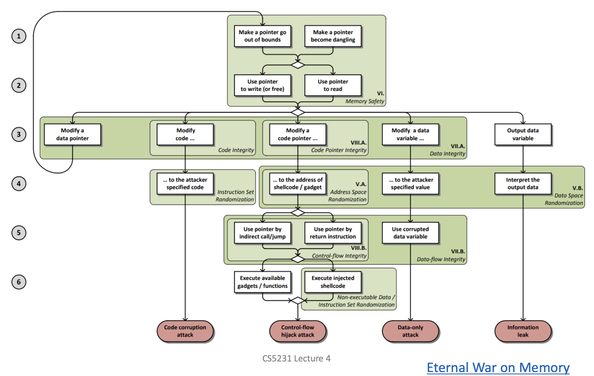

# Fight of memory attacks and defenses

- Attack and Defense Overview
    - **Ways**: buffer overflow, format string vuln,
    - Keys:
        - Have the payload in the memory, e.g., stored in data, libc, and gadgets. DEFENSE: NX
        - Be able to change the control flow (branch targets are hard-coded except for on heap or on stack). **Target addr**: forward-edge (function pointer, virtual function table) and backward-edge (the ret addr). DEFENSE: CFI, including vtable verification, indirect function call checker, indirect function call sanitizer, the stack canary, and shadow stack
        - Know the location of the payload. DEFENSE: (address space / data / code) randomization
        - Execute the payload. DEFENSE: NX.
    - Further explanation of DEFENSE
        - CFI: cross-language forward-edge CFI can be realized using IFCC of LLVM. It supports any language and indirect calls. The checking is initialized after the libraries are loaded and before constructors are initiated.
- A: Overflow the stack buffer
    - A: Overflow the stack buffer to overwrite the return address so as to go to any other addr
    - D: stack **canary** to detect the overwrite of the ret addr, i.e., **StackGuard**. But it can be bypassed.
    - A1: go to injected PoC stored in stack/heap data and execute malicious code (**Malicious code injection**)
    - D1: Not allow the data segment to be executed, i.e., **DEP** (data execution protection) or NX protection
    - A2: go to functions in the c library shared object, i.e., **ret2libc**. For example, prepare the arguments (the addr of`/bin/sh` in the libc memory space) for the `system()` function and its return value on the stack and return to the `system()` function.
    - D2: randomize the address space layout, i.e., **ASLR**
    - A3: go to gadgets in libc, i.e., return-oriented programming (**ROP**)
- A: Overflow the heap buffer
    - A1: change the target addr. leverage the dereference when removing one heap block from the chain, e.g., when executing *(b→l)=next next block, we modify the content pointed by h→l. If h→l is already changed to the ret addr, we can change the ret addr.
    - A2: heap spraying, i.e., allocate lots of heap memory to increase the probability of code execution. DEFENSE: ad hoc **CFI** techniques.
- A: arbitrary memory read/write
    - A: dereference a raw pointer to read/write. The address can be anywhere as long as you know it.
    - D: ASLR and data-space **randomization**
    - A: r/w the memory inside the current function using format string vulnerability
    - D: **stack protector** (in the compiler) to protect stack buffers, i.e., check if they are overflowed after the function exits
- A: Structured Exception Handler / [SEH-based buffer overflow](https://www.ired.team/offensive-security/code-injection-process-injection/binary-exploitation/seh-based-buffer-overflow)

Explanation of the below taxonomy

